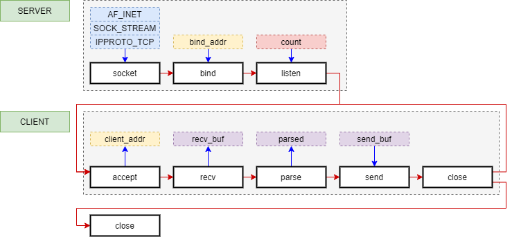

# HTTP Sync

# HTTP Async

Continuously parse the HTTP request while receiving it

Usefull functions:
- http_parser_pause
- http_body_is_final // for chunk encoding
- 

## Issues :

- ERROR "Accept failed on not wished connection" happend with CONFIG_POSIX_MAX_FDS=7 with 5 client socket + 1 server socket + 1 udp server

Explanation : we cannot accept a new connection since we reached the maximum number of file descriptor.

## Todo :

- Buffer manage to get buffers if necessary with MEM management SAB ?...
    - no malloc

## Sources :
- [POSIX accept](https://pubs.opengroup.org/onlinepubs/9699919799/functions/accept.html)
- [POSIX poll](https://pubs.opengroup.org/onlinepubs/9699919799/functions/poll.html)
- [POSIX select](https://pubs.opengroup.org/onlinepubs/9699919799/functions/select.html)
- [NETWORKING API](https://docs.zephyrproject.org/1.11.0/api/networking.html)
- [CONFIG_NET_TCP_BACKLOG_SIZE](https://docs.zephyrproject.org/latest/reference/kconfig/CONFIG_NET_TCP_BACKLOG_SIZE.html)
- [CONFIG_NET_MAX_CONN](https://docs.zephyrproject.org/latest/reference/kconfig/CONFIG_NET_MAX_CONN.html)
- [Bug in sockets.c (subsys\net\lib\sockets)](https://github.com/zephyrproject-rtos/zephyr/issues/22366)
- [net: socket: Release fd on failure in accept()](https://github.com/zephyrproject-rtos/zephyr/pull/22579)
- [accept fix : 
net: socket: Release fd on failure in accept()](https://github.com/zephyrproject-rtos/zephyr/pull/22579/commits/51700d6ec26f18c0b8a7e6f6dd6b50567ecfad6a#diff-8737bfcbf4e1123f640b49fdd117694c71098b728aabc4bcb42fbf1d5d64dfac)
- [CONFIG_POSIX_MAX_FDS](https://docs.zephyrproject.org/latest/reference/kconfig/CONFIG_POSIX_MAX_FDS.html)
- [CONFIG_POSIX_API](https://docs.zephyrproject.org/latest/reference/kconfig/CONFIG_POSIX_API.html#cmdoption-arg-CONFIG_POSIX_API)
- [CONFIG_POSIX_MAX_OPEN_FILES](https://docs.zephyrproject.org/latest/reference/kconfig/CONFIG_POSIX_MAX_OPEN_FILES.html)
- [CONFIG_NET_SOCKETS_POSIX_NAMES](https://docs.zephyrproject.org/latest/reference/kconfig/CONFIG_NET_SOCKETS_POSIX_NAMES.html)
- [CONFIG_NET_MAX_CONN](https://docs.zephyrproject.org/latest/reference/kconfig/CONFIG_NET_MAX_CONN.html)
- [Subsystem Configuration Options](https://developer.nordicsemi.com/nRF_Connect_SDK/doc/1.2.1/zephyr/reference/kconfig/index-subsys.html)
- [Network - Différence entre la MTU et la MSS](https://www.alasta.com/network/2015/07/05/Network-mtu-mss.html)
- [CONFIG_NET_SOCKETS_TLS_MAX_CONTEXTS](https://docs.zephyrproject.org/latest/reference/kconfig/CONFIG_NET_SOCKETS_TLS_MAX_CONTEXTS.html)

Examples :
- samples\net\sockets\echo_server

**Followed this implementation** :
- poll : https://www.ibm.com/docs/en/i/7.1?topic=designs-using-poll-instead-select