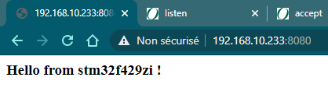

# HTTP Server

Todo:
- issue : problem : blocking chrome requests (2 requests in parallel)

```
[00:00:13.722,000] <err> net_tcp: net_conn_register(): -2
[00:00:13.722,000] <err> net_tcp: Cannot allocate a new TCP connection
```

- state machine 
- poll

## Chrome Request

Wireshark logs : [chrome_http_request.pcapng](./chrome_http_request.pcapng)



## Curl Request

Wireshark logs : [curl_http_request.pcapng](./curl_http_request.pcapng)

```
curl http://192.168.10.233:8080/url -v
```

Log Console

```
$ curl -v http://192.168.10.233:8080/url/23?zf=2
*   Trying 192.168.10.233:8080...
  % Total    % Received % Xferd  Average Speed   Time    Time     Time  Current
                                 Dload  Upload   Total   Spent    Left  Speed
  0     0    0     0    0     0      0      0 --:--:-- --:--:-- --:--:--     0* Connected to 192.168.10.233 (192.168.10.233) port 8080 (#0)
  0     0    0     0    0     0      0      0 --:--:-- --:--:-- --:--:--     0> GET /url/23?zf=2 HTTP/1.1
> Host: 192.168.10.233:8080
> User-Agent: curl/7.74.0
> Accept: */*
>
* Mark bundle as not supporting multiuse
< HTTP/1.1 200 OK
< Content-Type: text/html
< Connection: close
<
{ [59 bytes data]
100    59    0    59    0     0   1017      0 --:--:-- --:--:-- --:--:--  1000<html><body><h3>Hello from stm32f429zi !</h3></body></html>
* Closing connection 0

```

Log

```
[00:00:07.350,000] <inf> http_server: HTTP server up (1), waiting for TCP connections on port 8080 ...
[00:00:08.925,000] <inf> http_server: Connection #0 from 192.168.10.52
[00:00:08.946,000] <inf> http_server: HTTP request GET / : parsed 83/83 errno 0
[00:00:17.528,000] <inf> http_server: Connection #1 from 192.168.10.52
[00:00:17.551,000] <inf> http_server: HTTP request GET /url/23?zf=2 : parsed 94/94 errno 0
```

## python *requests* with URI

```
import requests

s = requests.get("http://192.168.10.233:8080/params/adecy/list?au=23")

print(s, len(s.text), s.text)
```

The URI `/params/adecy/list?au=23` appears just after the `GET` in the HTTP request.

## Long request

*see branch big_http_response for project configuration*
